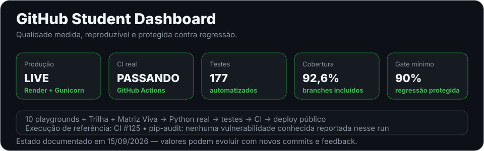

# Fernando Otávio Videira Junior

### Software Engineering • Full-Stack • Mobile • AI Systems

---

## Sobre mim

Sou estudante de **Engenharia de Software** e desenvolvedor focado em transformar aprendizado em software que possa ser executado, testado, analisado e melhorado.

- **Formação:** Engenharia de Software — Universidade de Vassouras
- **Foco:** aplicações reais, arquitetura, qualidade de código e automação
- **Interesses:** SaaS, sistemas multi-tenant, agentes de IA, backend e mobile
- **Método:** aprender → construir → testar → documentar → melhorar

> **Regra deste perfil:** ideia, roadmap e projeto executável não são a mesma coisa. Tudo abaixo é identificado pelo estado real.

---

# Use agora — projetos realmente executáveis

## GitHub Student Dashboard

Aplicação pública que analisa repositórios e perfis do GitHub usando checks determinísticos, evidências verificáveis e explicação pedagógica.

  

### O que funciona hoje

- análise de repositório por `usuario/repositorio` ou URL;
- análise de perfil público;
- README, descrição, licença, `.gitignore`, topics, CI, testes e dependências;
- status real da última execução do GitHub Actions;
- qualidade estrutural de README;
- links internos quebrados do README;
- comparação entre repositórios;
- histórico por commit;
- explicação local ou IA opcional;
- interface web, API JSON, testes e CI;
- laboratório educacional com **10 mini sistemas ligados ao backend Flask e às funções Python originais**;
- **Trilha Educacional com 6 níveis e 18 missões ligadas a evidências reais**, com progresso local no navegador;
- **Matriz Viva de Competências com 10 competências**, construída a partir de código público, testes, CI, deploy, documentação e contribuição open source — sem transformar evidência em certificação automática de domínio;
- **180 testes automatizados passando** na execução de referência;
- **92,6% de cobertura real**, medida com branches e protegida por gate mínimo de **90%**;
- auditoria informativa de dependências com `pip-audit`, sem vulnerabilidade conhecida reportada na execução de referência.

### Abrir

- **Aplicação:** https://github-student-dashboard-videirafoo.onrender.com
- **Trilha Educacional:** https://github-student-dashboard-videirafoo.onrender.com/trilha
- **Matriz Viva de Competências:** https://github-student-dashboard-videirafoo.onrender.com/competencias
- **Laboratório interativo:** https://github-student-dashboard-videirafoo.onrender.com/laboratorio
- **Evidências de qualidade:** [`QUALITY.md`](./QUALITY.md)
- **Showcase:** [`SHOWCASE.md`](./SHOWCASE.md)
- **Código:** [`projetos/github_student_dashboard`](./projetos/github_student_dashboard)
- **Documentação:** [`README do Dashboard`](./projetos/github_student_dashboard/README.md)

---

## Matriz Viva de Competências — evidência, não autodeclaração

A matriz existe para responder uma pergunta mais útil do que “quais tecnologias estão na bio?”: **quais competências possuem evidências públicas verificáveis neste momento?**

Ela verifica, entre outros sinais:

- repositórios acadêmicos com código Python;
- algoritmos e recursividade versionados;
- presença dos 10 mini sistemas e seus testes;
- backend Flask e API HTTP;
- workflow de CI e gate de cobertura;
- execução pública do serviço;
- documentação técnica canônica;
- estado real do Pull Request open source externo;
- separação entre motor determinístico e camada explicativa de IA.

Estados possíveis de uma competência:

`forte` · `parcial` · `sem evidência verificada` · `indisponível`

A regra mais importante é deliberadamente conservadora: **um PR aberto comprova contribuição enviada; só um merge público comprova aceitação externa.** Da mesma forma, a existência de um arquivo ou projeto é evidência técnica, mas não é usada para afirmar domínio pessoal automaticamente.

**Abrir matriz:** https://github-student-dashboard-videirafoo.onrender.com/competencias

---

## Laboratório de Projetos — os 10 mini sistemas podem ser usados

O laboratório existe para evitar um perfil cheio de nomes de projetos sem experiência prática.

**Fluxo recomendado:**

`usar no navegador` → `entender o comportamento` → `abrir o Python` → `abrir os testes` → `alterar sua cópia`

**Não são apenas demos visuais:** as regras centrais dos 10 playgrounds passam pelo **Flask** e reaproveitam as **funções Python reais** versionadas em `conteudos/mini_sistemas`. O estado didático permanece no navegador sempre que possível para não misturar dados entre visitantes.

Hoje os **10 mini sistemas** possuem experiência prática no navegador:

| # | Playground | O que pratica | Código original |
|---:|---|---|---|
| 01 | Agenda de contatos | cadastro, busca, remoção e persistência | [`agenda_contatos`](./conteudos/mini_sistemas/agenda_contatos) |
| 02 | Lista de tarefas | CRUD, estado, conclusão e persistência | [`lista_tarefas`](./conteudos/mini_sistemas/lista_tarefas) |
| 03 | Cadastro de aluno | entrada, validação, média e regras | [`cadastro_alunos`](./conteudos/mini_sistemas/cadastro_alunos) |
| 04 | Controle de estoque | produtos, quantidade, preço e total | [`controle_estoque`](./conteudos/mini_sistemas/controle_estoque) |
| 05 | Sistema de biblioteca | livros, usuários, empréstimos e devolução | [`sistema_biblioteca`](./conteudos/mini_sistemas/sistema_biblioteca) |
| 06 | Caixa de mercado | catálogo, carrinho, desconto e fechamento | [`caixa_mercado`](./conteudos/mini_sistemas/caixa_mercado) |
| 07 | Controle financeiro | receitas, despesas, categorias e saldo | [`controle_financeiro`](./conteudos/mini_sistemas/controle_financeiro) |
| 08 | Gerenciador de hábitos | meta semanal, registros e progresso | [`gerenciador_habitos`](./conteudos/mini_sistemas/gerenciador_habitos) |
| 09 | API de tarefas | GET, POST, PATCH, DELETE e status HTTP | [`api_tarefas`](./conteudos/mini_sistemas/api_tarefas) |
| 10 | Projeto integrado | checks determinísticos, score e recomendações | [`projeto_integrado`](./conteudos/mini_sistemas/projeto_integrado) |

O laboratório também inclui **busca binária visual** como bônus de algoritmos.

**Abrir laboratório:** https://github-student-dashboard-videirafoo.onrender.com/laboratorio

---

# Código completo para estudar

A coleção de mini sistemas não é apenas uma lista em Markdown. Há diretórios reais versionados com implementação, README e testes.

| Sistema | Código |
|---|---|
| Agenda de contatos | [`conteudos/mini_sistemas/agenda_contatos`](./conteudos/mini_sistemas/agenda_contatos) |
| Lista de tarefas | [`conteudos/mini_sistemas/lista_tarefas`](./conteudos/mini_sistemas/lista_tarefas) |
| Cadastro de alunos | [`conteudos/mini_sistemas/cadastro_alunos`](./conteudos/mini_sistemas/cadastro_alunos) |
| Controle de estoque | [`conteudos/mini_sistemas/controle_estoque`](./conteudos/mini_sistemas/controle_estoque) |
| Sistema de biblioteca | [`conteudos/mini_sistemas/sistema_biblioteca`](./conteudos/mini_sistemas/sistema_biblioteca) |
| Caixa de mercado | [`conteudos/mini_sistemas/caixa_mercado`](./conteudos/mini_sistemas/caixa_mercado) |
| Controle financeiro | [`conteudos/mini_sistemas/controle_financeiro`](./conteudos/mini_sistemas/controle_financeiro) |
| Gerenciador de hábitos | [`conteudos/mini_sistemas/gerenciador_habitos`](./conteudos/mini_sistemas/gerenciador_habitos) |
| API de tarefas | [`conteudos/mini_sistemas/api_tarefas`](./conteudos/mini_sistemas/api_tarefas) |
| Projeto integrado | [`conteudos/mini_sistemas/projeto_integrado`](./conteudos/mini_sistemas/projeto_integrado) |

**Coleção completa:** [`conteudos/mini_sistemas`](./conteudos/mini_sistemas)

---

## Projetos acadêmicos com código

| Repositório | Conteúdo |
|---|---|
| [Lista-01-segundo-periodo](https://github.com/Videirafoo/Lista-01-segundo-periodo) | fundamentos de algoritmos e lógica em Python |
| [Lista-02-segundo-periodo](https://github.com/Videirafoo/Lista-02-segundo-periodo) | listas, funções e manipulação de dados |
| [Lista-03-segundo-periodo](https://github.com/Videirafoo/Lista-03-segundo-periodo) | busca sequencial e busca binária |
| [lista-04-segundo-periodo](https://github.com/Videirafoo/lista-04-segundo-periodo) | recursividade em Python |
| [lista-05-revisao-segundo-periodo](https://github.com/Videirafoo/lista-05-revisao-segundo-periodo) | revisão de algoritmos e lógica |
| [jogo_primeiro_periodo](https://github.com/Videirafoo/jogo_primeiro_periodo) | jogo de adivinhação com funções, validação e CI |

---

# Conteúdo didático

Para quem está começando, o repositório possui uma trilha que combina documentação e prática executável:

- **[Trilha Educacional interativa](https://github-student-dashboard-videirafoo.onrender.com/trilha)** — 6 níveis, 18 missões e progresso baseado em evidências;
- **[Matriz Viva de Competências](https://github-student-dashboard-videirafoo.onrender.com/competencias)** — competências ligadas a evidências públicas que se atualizam sem inflar progresso artificialmente;
- [`GUIA_DE_ESTUDOS.md`](./GUIA_DE_ESTUDOS.md) — mapa conceitual e evidências de domínio;
- [`PADRAO_DE_ENSINO.md`](./PADRAO_DE_ENSINO.md) — regra canônica para criar conteúdo educacional;
- [`conteudos/python-para-iniciantes`](./conteudos/python-para-iniciantes)
- [`IDEIAS_DE_PROJETOS.md`](./IDEIAS_DE_PROJETOS.md) — **ideias, não projetos entregues**
- [`ROADMAP_CONTEUDO.md`](./ROADMAP_CONTEUDO.md) — planejamento e estado das próximas entregas
- [`REFERENCIAS_OPEN_SOURCE.md`](./REFERENCIAS_OPEN_SOURCE.md) — referências estudadas e padrões generalizados absorvidos

> Documentação serve para explicar software. Ela não substitui o software. Progresso educacional precisa de evidência prática.

---

# Planejado — ainda não apresentado como projeto pronto

As coleções abaixo são **direção futura**. Elas não são tratadas como repositórios entregues enquanto não houver código executável, exemplos e validação:

- `algoritmos-e-estruturas`
- `projetos-web-iniciante`
- `desafios-mobile-flutter`

`python-para-iniciantes` e os mini sistemas já existem **como conteúdo dentro deste repositório**, e não como repositórios independentes.

---

## Projetos em desenvolvimento

### MarcaIA
SaaS multi-tenant para atendimento, agenda, CRM, automações e IA. **Em desenvolvimento; não é apresentado aqui como demo pública concluída.**

### FitCore Pro
Aplicação mobile para treino e gestão fitness. **Em desenvolvimento; não é apresentado aqui como produto público concluído.**

---

## Stack principal

`Java` · `Python` · `TypeScript` · `JavaScript` · `Flutter` · `Dart` · `Next.js` · `React` · `Node.js` · `PostgreSQL` · `Supabase` · `REST APIs` · `Git` · `GitHub Actions` · `Docker` · `Linux`

---

## Open source e comunidade

- **Guia:** [`OPEN_SOURCE_START.md`](./OPEN_SOURCE_START.md)
- **Primeiro PR externo verificável — em revisão:** [fork-commit-merge/fork-commit-merge#8150](https://github.com/fork-commit-merge/fork-commit-merge/pull/8150)
- **Rastreamento da contribuição:** [Issue #6](https://github.com/Videirafoo/Videirafoo/issues/6)
- **Como contribuir aqui:** [`CONTRIBUTING.md`](./CONTRIBUTING.md)
- **Comunidade:** [`COMMUNITY.md`](./COMMUNITY.md)
- **Código de conduta:** [`CODE_OF_CONDUCT.md`](./CODE_OF_CONDUCT.md)
- **Segurança:** [`SECURITY.md`](./SECURITY.md)

A regra permanece: **PR aberto é evidência de contribuição enviada; contribuição aceita só será registrada depois do merge público.**

---

## GitHub em números

  

> Os cards são gerados pelo próprio repositório com GitHub Actions e publicados como SVG estático.

---

## Atividade

<picture>
  <source media="(prefers-color-scheme: dark)" srcset="https://raw.githubusercontent.com/Videirafoo/Videirafoo/gh-pages/github-contribution-grid-snake-dark.svg">
  <source media="(prefers-color-scheme: light)" srcset="https://raw.githubusercontent.com/Videirafoo/Videirafoo/gh-pages/github-contribution-grid-snake.svg">
  
</picture>

---

## Objetivo do perfil

Construir uma trajetória que outra pessoa consiga verificar e reproduzir:

`fundamento` → `exercício` → `missão prática` → `evidência` → `sistema` → `teste` → `CI` → `deploy` → `open source` → `melhoria`

### Código é prática. Engenharia é decisão.

