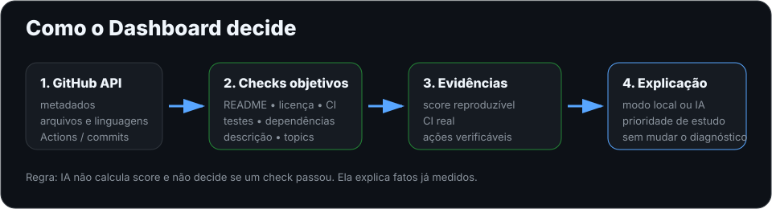

# GitHub Student Dashboard — Showcase

Este documento reúne, **dentro do próprio GitHub**, o que já está funcionando no projeto público principal do `Videirafoo`.

> Objetivo: permitir que estudantes, recrutadores, mantenedores open source e pessoas da comunidade entendam rapidamente o produto, como ele funciona e quais resultados ele já consegue comprovar.

## Status público

<p align="center">
  
</p>

- Produção: https://github-student-dashboard-videirafoo.onrender.com
- Healthcheck: https://github-student-dashboard-videirafoo.onrender.com/healthz
- CI: [GitHub Student Dashboard CI](https://github.com/Videirafoo/Videirafoo/actions/workflows/student-dashboard.yml)
- Changelog: [`projetos/github_student_dashboard/CHANGELOG.md`](./projetos/github_student_dashboard/CHANGELOG.md)
- Feedback: https://github.com/Videirafoo/Videirafoo/issues/new?template=dashboard-feedback.yml
- Comunidade: [`COMMUNITY.md`](./COMMUNITY.md)
- Primeira tarefa aberta para contribuidores: [Issue #8](https://github.com/Videirafoo/Videirafoo/issues/8)

## O que o produto já faz

| Área | Entrega atual |
|---|---|
| Repositório | score determinístico + 8 checks verificáveis |
| Perfil | cobertura de descrição, topics e licença; stars, forks e linguagens |
| CI | consulta a execução real mais recente do GitHub Actions |
| README | análise estrutural + verificação segura de links internos do próprio repositório |
| Comparação | dois repositórios lado a lado sem declarar vencedor subjetivo |
| Histórico | reconstrução por commit de README, `.gitignore`, CI, testes e dependências |
| Testes | detecção por padrões comuns de Python, JS/TS, Go, Dart/Flutter, Ruby, Java/Kotlin, C#, PHP e diretórios convencionais |
| Explicação | modo local transparente + IA externa opcional |
| Produção | Flask + Gunicorn no Render |
| Descoberta | `robots.txt`, `sitemap.xml` e healthcheck |
| Comunidade | feedback estruturado, formulários de bug/melhoria, segurança, contribuição, código de conduta e `good first issue` |

## Resultados reais já verificados

Os exemplos abaixo foram observados usando o próprio `Videirafoo` como caso de teste.

### `Videirafoo/Videirafoo`

- score observado na rodada de validação: **80/100**;
- CI real: **success**;
- README: **100% de cobertura documental, 7/7 critérios**;
- checks atendidos: README, licença, `.gitignore`, CI, testes e dependências;
- lacunas objetivas observadas naquele momento: descrição do repositório e topics.

> Esses valores podem mudar conforme os metadados e o código do repositório evoluem.

### Comparação real usada durante o desenvolvimento

`Videirafoo/Videirafoo` vs `Videirafoo/Lista-01-segundo-periodo`

| Evidência | Perfil principal | Lista 01 |
|---|---:|---:|
| Score observado | 80/100 | 50/100 |
| README | 100% | 55,6% |
| CI real | success | success |
| Dependências | OK | falta |
| Licença | OK | falta |
| Testes | OK | falta |
| Descrição | falta | OK |
| Topics | falta | falta |

A comparação não declara um vencedor geral. Ela mostra somente diferenças verificáveis.

## Histórico de evolução

O histórico não tenta reconstruir metadados que o Git não preserva com segurança. Ele acompanha somente sinais realmente versionados:

- README;
- `.gitignore`;
- workflow de CI;
- testes;
- dependências.

Na validação com os 5 commits mais recentes do perfil, esses cinco sinais estavam presentes em todos os pontos da janela analisada.

## Qualidade do README e links internos

A análise de README agora também verifica caminhos internos Markdown/HTML contra a árvore do repositório.

Ela pode identificar arquivos ou pastas internas ausentes sem transformar URLs externas em requisições arbitrárias. Anchors locais e links externos são ignorados por essa verificação.

Se a árvore não puder ser confirmada, o sistema informa que a verificação não foi realizada em vez de inventar um erro.

## IA explicativa

A camada explicativa segue uma restrição arquitetural deliberada:

```text
GitHub API
   ↓
checks determinísticos
   ↓
evidências + score + CI real
   ↓
explicação pedagógica local ou por IA
```

A IA **não calcula o score**, **não decide se um check passou** e **não substitui evidências**.

Sem `OPENAI_API_KEY`, o produto usa um modo local transparente e continua plenamente utilizável.

## Arquitetura visual

<p align="center">
  
</p>

## Teste em menos de 2 minutos

1. Abra https://github-student-dashboard-videirafoo.onrender.com
2. Em **Analisar repositório**, use `Videirafoo/Videirafoo`.
3. Abra **Qualidade do README** e analise o mesmo repositório.
4. Observe também o estado dos links internos encontrados no README.
5. Em **Comparar**, use `Videirafoo/Videirafoo` e `Videirafoo/Lista-01-segundo-periodo`.
6. Em **Histórico**, analise 5 commits.
7. Em **Explicação**, confira o modo local e as prioridades detectadas.
8. Se algo ficar confuso, envie feedback pelo formulário público.

## Endpoints públicos

```http
GET /healthz
GET /api/analisar?repo=Videirafoo/Videirafoo
GET /api/perfil?usuario=Videirafoo
GET /api/readme?repo=Videirafoo/Videirafoo
GET /api/comparar?a=Videirafoo/Videirafoo&b=Videirafoo/Lista-01-segundo-periodo
GET /api/historico?repo=Videirafoo/Videirafoo&limite=5
GET /api/explicar?repo=Videirafoo/Videirafoo
```

## Comece a contribuir

Se você está começando em open source, a [Issue #8](https://github.com/Videirafoo/Videirafoo/issues/8) foi escrita especificamente como uma primeira contribuição pequena e verificável.

Ela pede exemplos públicos da API com `curl` e PowerShell, sem exigir alteração na lógica do produto.

O repositório também possui:

- [`CONTRIBUTING.md`](./CONTRIBUTING.md);
- [`COMMUNITY.md`](./COMMUNITY.md);
- [`CODE_OF_CONDUCT.md`](./CODE_OF_CONDUCT.md);
- [`SECURITY.md`](./SECURITY.md);
- [formulário de bug](https://github.com/Videirafoo/Videirafoo/issues/new?template=bug-report.yml);
- [formulário de melhoria](https://github.com/Videirafoo/Videirafoo/issues/new?template=feature-request.yml);
- [template de Pull Request](./.github/PULL_REQUEST_TEMPLATE.md).

## Por que este projeto existe

O Dashboard não foi criado para produzir uma nota decorativa. Ele faz parte de uma trajetória educacional maior:

**fundamentos → conteúdo para iniciantes → mini sistemas → produto público → feedback → open source externo → comunidade → reconhecimento**.

O objetivo é transformar boas práticas de GitHub em algo que uma pessoa iniciante consiga **ver, entender e aplicar**.

## Próximo estágio

- cobertura real de testes quando disponível;
- análise informativa de vulnerabilidades/dependências;
- histórico persistente de análises quando houver motivo de produto para armazená-las;
- incorporar melhorias vindas de feedback real;
- concluir a primeira contribuição open source externa verificável.
